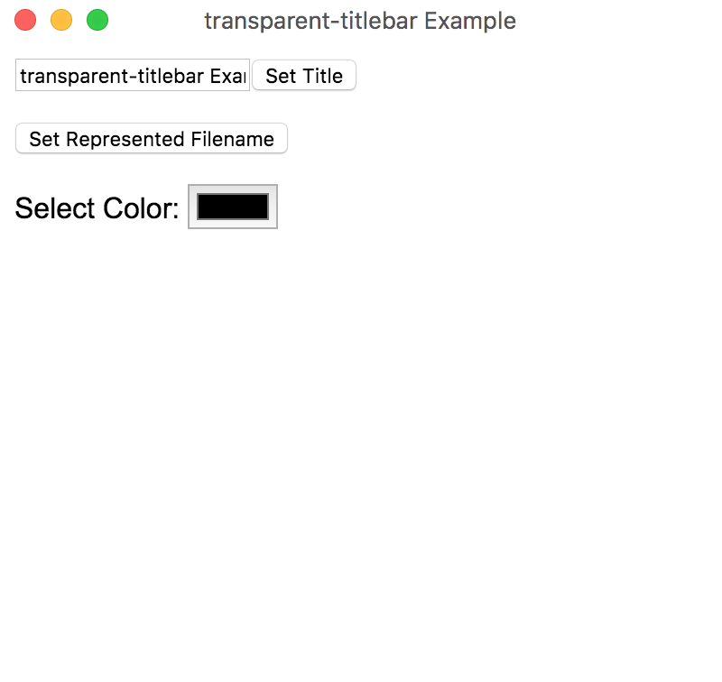
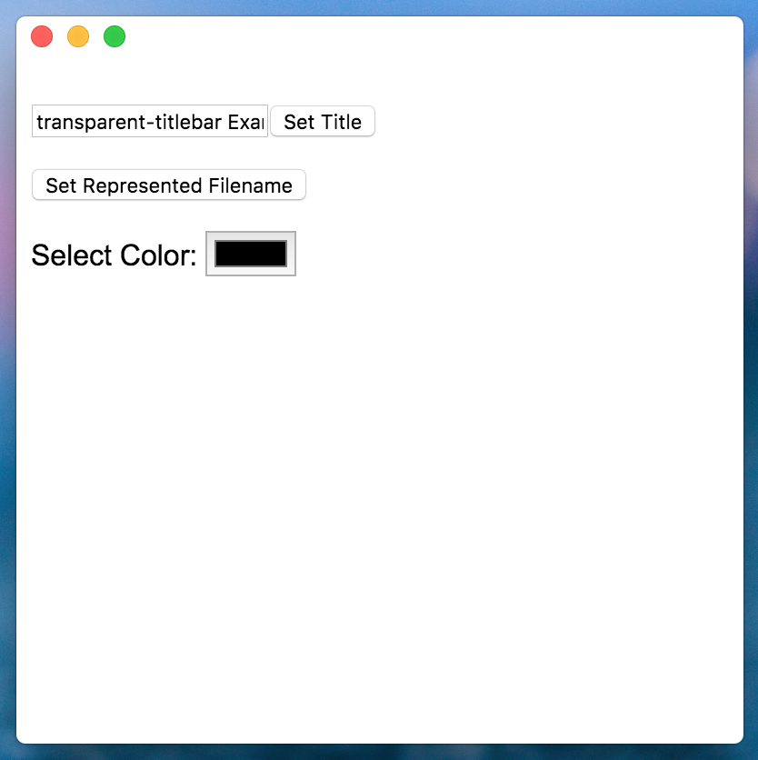
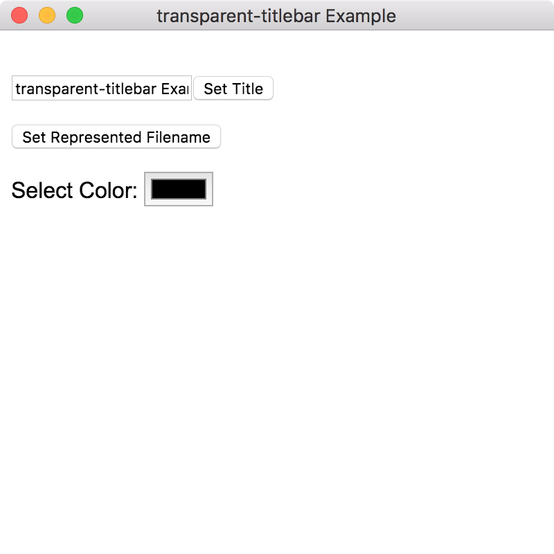

# transparent-titlebar

Setup transparent titlebar with titles for Electron window in Mac


|Using transparent-titlebar|titleBarStyle: hidden in Electron|Normal|
|-|-|-|
|  |  |  |

## Install

```
npm install transparent-titlebar
```

TypeScript definitions are included.

## Use

```js
let win: BrowserWindow
const transparentTitlebar = require('transparent-titlebar')

// Setup window to use transparent titlebar
transparentTitlebar.setup(win.getNativeWindowHandle())

// Set title color (must be called whenever the title has changed)
transparentTitlebar.setColor(win.getNativeWindowHandle(), 1, 0, 0, 1)
```

## Run Example

```
cd examples
npm install
npm start
```